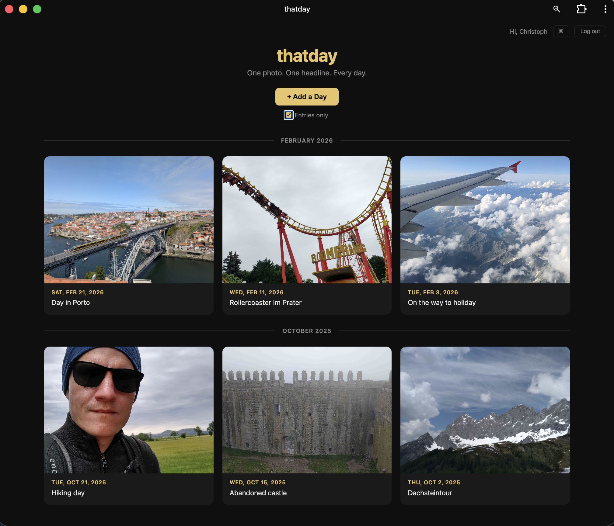

# thatday

> One photo. One headline. Every day.

A personal daily journal app built with love and 100% vibe-coding.

**[Live Demo](https://thatday-vibe-coded.onrender.com/)**

## What it does

Capture each day with a photo or video and a short headline (max 300 characters). Browse your memories in a beautiful photo-tile grid, discover "On This Day" entries from previous years, and view them in a slideshow. Works offline as a Progressive Web App (PWA), and can be installed as a native app on Android.

## Features

- **One entry per day** — photo or video + headline
- **Calendar view** — see every day from today back to your oldest entry, with month separators
- **Empty placeholders** — click any day without an entry to add one
- **Slideshow** — prev/next navigation through your entries (arrow keys or buttons)
- **On This Day** — shows entries from the same date in previous years
- **Video upload** — capture or upload videos alongside photos
- **Light & Dark mode** — toggle in the header
- **Filter** — show only days with entries
- **Offline support** — works without internet via Service Worker
- **Mobile-ready** — wrap with Capacitor for Android



## Tech Stack

| Layer | Technology |
|-------|------------|
| Backend | Express.js 5.x |
| Database | Flat JSON files (no external DB) |
| Auth | JWT + bcrypt |
| Frontend | Vanilla HTML, CSS, JavaScript |
| Photo/Video processing | Sharp + FFmpeg (resize/compress to ≤500KB) |
| PWA | Service Worker + Web Manifest |
| Mobile | Capacitor (Android) |

## Running Locally

```bash
# Install dependencies
npm install

# Start the server
npm start
```

The app runs at **http://localhost:3000**

### Environment Variables

| Variable | Default | Description |
|----------|---------|-------------|
| `PORT` | 3000 | Server port |
| `JWT_SECRET` | thatday-secret-change-me | JWT signing secret |
| `APP_ENV` | dev | Set to "prod" for production |
| `BASE_URL` | http://localhost:3000 | Used for email links |
| `SMTP_HOST` | — | SMTP server for emails (prod only) |
| `SMTP_PORT` | 587 | SMTP port |
| `SMTP_USER` | — | SMTP username |
| `SMTP_PASS` | — | SMTP password |
| `SMTP_FROM` | noreply@thatday.app | Sender email address |

In dev mode, confirmation emails are logged to the console instead of being sent.

## Project Structure

```
thatday/
├── server.js          # Express backend (all API routes)
├── public/            # Frontend (static files)
│   ├── index.html     # Main app
│   ├── login.html     # Login/register
│   ├── confirm.html   # Email confirmation
│   ├── app.js         # Frontend logic
│   ├── style.css      # Styles
│   ├── sw.js          # Service Worker
│   └── dist/          # External packages
├── data/              # Runtime data (gitignored)
│   ├── users/         # User JSON files
│   ├── entries/       # Entry JSON files
│   └── uploads/       # Photos
└── android/           # Capacitor Android project
```

## Building for Android

```bash
npm install @capacitor/cli @capacitor/android

npx cap add android
npx cap run android
```

## 100% Vibe-Coded

This app was built with intuition, iteration, and a healthy disregard for best practices. No tests. No type safety. No deployment pipeline. Just vibes and functionality.

Built by Christoph Maurer
